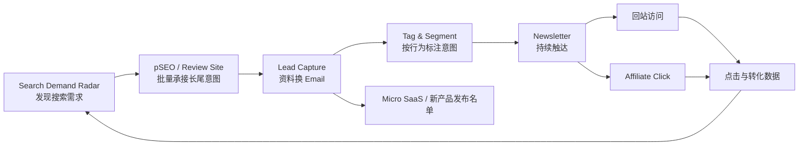

# 方案 01：流量与邮件名单飞轮

## 主体定位

先通过 Search Demand 和 pSEO/Review 内容获得精准搜索流量，再把一次性访客转化为带意图标签的 Email List，通过 Newsletter 反复触达，并将点击行为反哺选题、选品和后续产品发布。

## 主体实现流程

## 系统组成

1. Search Demand Radar：持续发现关键词与用户焦虑主题。
2. pSEO + Review Site：将需求转成可排名页面。
3. Lead Capture：用高价值资料把匿名流量转为自有触达权。
4. Intent Tag：根据来源页面、下载内容和点击行为分群。
5. Newsletter：按意图持续发送内容和产品推荐。
6. Affiliate / Product Launch：完成收入转化并反哺选题。

## 核心特征

- 内容是主要流量载体。
- Email List 是主复利资产。
- 产品方向由搜索、点击和转化行为反向决定。
- Micro SaaS 是名单的后续承接，不是飞轮的第一环。

## 相关候选路径（非决策）

- [职业资产库 × 免费检索 × Newsletter 付费分发](候选路径_职业资产库_免费检索与Newsletter付费分发.md)：若走该备选，本飞轮主要承担分发层与 Email 沉淀。
- [极窄切口 × Control/Treatment × PILOT 验证](候选路径_极窄切口_Control-Treatment_PILOT验证.md)：若走该备选，本飞轮侧先用极窄单点页做对照实验与 ~60 访验证，再表→工具、同库 pSEO 拓词。

