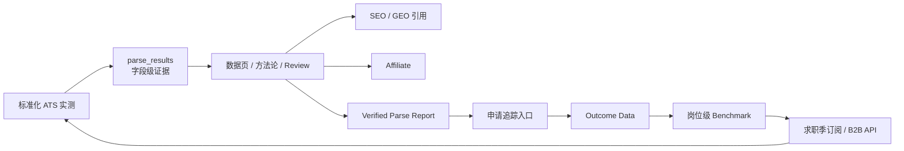

# 方案 03：ATS 实测证据飞轮

> **状态：已关闭（2026-07-20）。** 三次测试支持方法论与案例内容，不支持收费服务、行业 Benchmark 或持续扩样。既有材料只做一次性 SEO/GEO 内容转化，正式决策见 [`../../../decisions/2026-07-20_ATS实测仅保留内容资产并关闭商业化飞轮.md`](../../../decisions/2026-07-20_ATS实测仅保留内容资产并关闭商业化飞轮.md)。下文保留为历史方案，不再作为执行路线。

## 主体定位

以标准化 Verified ATS 实测作为第一生产环节，把独立证据转成数据内容、GEO 引用、Affiliate 和付费报告，再通过报告内的追踪入口沉淀 Outcome 与岗位 Benchmark。

## 主体实现流程

## 系统组成

1. ATS Test Infrastructure：对真实 ATS 环境运行一致的测试样本。
2. `parse_results`：存储可复验的解析结果和证据。
3. Evidence Content：数据即内容，形成评测页和方法论页面。
4. Report Product：面向具体简历交付 Verified Parse Report。
5. Outcome Pipeline：通过报告内的申请追踪入口沉淀结果。
6. Benchmark / API：把单次实测升级为岗位级数据服务。

## 核心特征

- 独立实测是第一推动力。
- `parse_results` 和公开方法论构成差异化证据。
- 内容是实测数据的表达副产品。
- Affiliate 必须与排名和实测结论隔离，维护裁判信誉。
