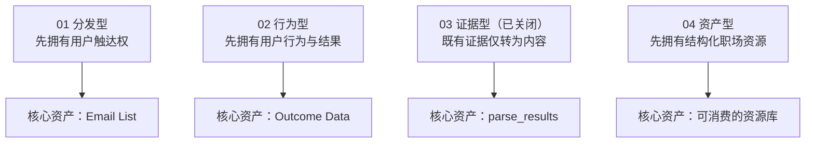

# CareerRadar 核心运行飞轮

> 历史上并列评估四种主体实现模型。**03 ATS 实测证据飞轮已于 2026-07-20 关闭商业化路线**，仅保留一次性内容资产化；01、02、04 仍处于探索状态。
> 另存在一个**横跨四方案的系统层假设**（“造工具的工厂”本身是 Class A，CareerRadar 是首个实例），不是第五个并列飞轮，详见 [`../_overview.md`](../_overview.md) 的“系统层假设”一节。

## 上位判断原则

- 四种飞轮都应接受 [`两种杠杆判别法：离机器近，离文化远`](../../../thinking/两种杠杆判别法_离机器近离文化远.md) 检查：优先把信任固化进可验证的方法、数据和系统，谨慎进入依赖创始人履历、文化直觉与持续人格在场的位置。
- 「做不做 / MVP / 红线」硬筛见 [`决策原则_红线与MVP反脆弱九门`](../决策原则_红线与MVP反脆弱九门.md)；飞轮选型须能通过三红线与九门，不得用战略叙事绕过。
- 该原则是跨项目 Engine；本目录只记录它在 CareerRadar 中的应用。

## 默认加载规则

- **默认记忆入口**:本文件。
- **默认执行基线**:[01 流量与邮件名单飞轮](01-流量与邮件名单飞轮.md)。原因是 SEO、Affiliate、Email 是当前现实运行底座,也是其他三种产品/数据飞轮的获客前置。
- **默认不等于最终选择**:01 只解决 AI 在普通 CareerRadar 问题中的上下文锚点;01、02、04 仍处于 `exploring`，03 已关闭。
- 问题明确命中 02/04 时,对应方案成为主记忆,01 降为辅助或不加载；命中 03 时必须同时加载关闭决策，只将其作为历史方案与内容证据来源。

## 核心区别

| 方案 | 状态 | 第一推动力 | 主体实现 | 核心沉淀 | 主要收入出口 |
|---|---|---|---|---|---|
| [01 流量与邮件名单飞轮](01-流量与邮件名单飞轮.md) | exploring | Search Demand | pSEO/Review 内容 → Lead Capture → Newsletter | SEO 权重、Email List、意图标签 | Affiliate、资料包、Micro SaaS 发布 |
| [02 职业智能数据飞轮](02-职业智能数据飞轮.md) | exploring | 用户使用职业工具 | 诊断 → 修改 → 再测 → Outcome 回传 | 行为数据、Outcome Data、Career Intelligence | 诊断工具、订阅、Career Agent |
| [03 ATS 实测证据飞轮](03-ATS实测证据飞轮.md) | **closed** | 标准化 ATS 实测 | 仅将既有 case 转为方法论与 SEO/GEO 内容 | 可引用框架、案例内容 | 不设独立收入出口，服务 01/04 |
| [04 职场资源资产库飞轮](04-职场资源资产库飞轮.md) | exploring | 结构化职场资源生产 | 采集 → LLM 结构化 → 人工精审 → 资产页 | 真题库、简历句型库、沟通模板库 | Affiliate、付费资料包、资产订阅 |

## 四种模型的本质

## 读取规则

- 问获客、Email、Newsletter、Affiliate：读方案 01。
- 问工具行为、Career Intelligence、Outcome：读方案 02。
- 问 ATS 实测、裁判定位、证据报告：读方案 03，并同时加载其[关闭决策](../../../decisions/2026-07-20_ATS实测仅保留内容资产并关闭商业化飞轮.md)，不得恢复为默认执行路线。
- 问真题、简历句型、沟通模板和数字资产库：读方案 04。
- 问「资产库 + Newsletter 付费分发」组合路径：可读[候选路径](候选路径_职业资产库_免费检索与Newsletter付费分发.md)，**仅作备选**，不得当作已定执行路线。
- 问极窄切口、Control/Treatment 决策页、PILOT 60 访、静态表升级工具、同库长尾拓词：可读[候选路径](候选路径_极窄切口_Control-Treatment_PILOT验证.md)，**仅作备选**。
- 问 CareerRadar 总体战略：先读本索引，再按问题下钻；不得默认其中一个已经胜出。

## 候选路径（非决策）

| 文件 | 组合关系 | 状态 |
|---|---|---|
| [职业资产库 × 免费检索 × Newsletter 付费分发](候选路径_职业资产库_免费检索与Newsletter付费分发.md) | 04 作资产库与付费标的；01 作分发与列表沉淀；免费内容作检索入口 | exploring / candidate |
| [极窄切口 × Control/Treatment × PILOT 验证](候选路径_极窄切口_Control-Treatment_PILOT验证.md) | 01 侧获客验证：极窄单点切口、对照页形态、~60 访样本量、表→工具、同库 pSEO 拓词 | exploring / candidate |

## 原始来源

原件保留在本地私有目录 `local/doc/seo工具战略规划/`；GitHub 可追踪副本位于 [`sources/`](sources/)，整理版本位于本目录。

- [本批次导入记录与回退范围](_import-record.md)
- [01 原始脑图](sources/01-流量与邮件名单飞轮-原始脑图.mm)
- [02 原始脑图](sources/02-职业智能数据飞轮-原始脑图.mm)
- [03 原始脑图](sources/03-ATS实测证据飞轮-原始脑图.mm)
- [04 原始文档](sources/04-职场资源资产库飞轮-原始文档.md)
